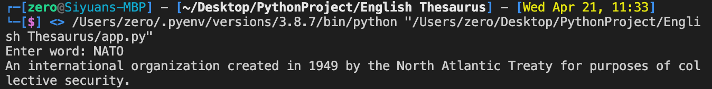
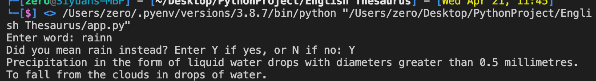

# Interactive English Dictionary

This app has preload dictionary can take user input and return the definition. It also understand acronyms and perform close match if user input is not found.

## Some examples output

 

